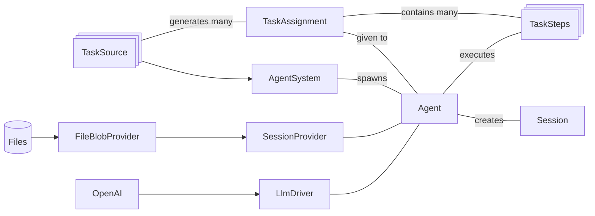

# ARC Prize
Experiments related to the ARC AGI prize for reasoning on problems the agent has never seen.


## Challenge description
> The [Abstraction and Reasoning Corpus for Artificial General Intelligence (ARC-AGI) benchmark](https://arcprize.org/) measures an AI system's ability to efficiently learn new skills. Humans easily score 85% in ARC, whereas the best AI systems only score 34%. The ARC Prize competition encourages researchers to explore ideas beyond LLMs, which depend heavily on large datasets and struggle with novel problems.

> The objective of this competition is to create an algorithm that is capable of solving abstract reasoning tasks. Critically, these are novel tasks: tasks that the algorithm has never seen before. Hence, simply memorizing a set of reasoning templates will not suffice.


## Goals
Others have tried LLM's on the arc-prize and obtained poor results as described in [GPT4 ARC Prize Evaluation Paper](https://openreview.net/pdf?id=3rGT5OkzpC).  

> "LLMs like Gemini or ChatGPT [don't work] because they're basically frozen at inference time. They're not actually learning anything." - François Chollet

We think that there are approaches which can make the above statement false and overcome those limitations.  In this repo we will explore some ideas and see what they can do.  Briefly the ideas involve overcoming some of the limitations of LLMs using external storage, loops, [Reflexion](https://arxiv.org/pdf/2303.11366), [chain of thought self-consistency (CoT-SC)](https://arxiv.org/abs/2203.11171), and other ideas.

Although LLM's are frozen at inference time, there are ways to overcome this limitation.  One way that others are working on is data augmentation and fine-tuning at inference time, Test Time Training (TTT).  Another way is Reflexion.

## Brief summary of ideas
* Create a hypothesis on how to solve the task
* Evaluate that hypothesis against the training items, but hold out one of the training items to use for a mini internal evaluation
* If we fail on the task against the held out item, use reflexion to give self-advice. Try the held out item again, and iterate on this up to N times until we succeed.
* If we don't succeed, hold this one out for deeper analysis later.  We will use deeper thinking strategies on these at the end using our remaining processing time. (Note there is a 12 hour processing time limit.)

In the docs folder we have [an example GPT transcript embodying the above ideas](doc/sample-transcript.md).

* Use CoT-SC to run trials multiple times to ensure accuracy.
* Take advantage of the fact that we can try an item up to 3 times.  We can use the additional information we gain from having a failed hypothesis to our advantage.
* We can incorpoate tools to do analysis on the items, for example doing flood fills, copying blocks of data from the input to the output, and other tedious/error prone operations.
* We can do image analysis to gain additional insights during the deeper analysis phase when needed.

## Papers
* [ReAct: Synergizing Reasoning and Acting in Language Models](https://arxiv.org/abs/2210.03629)
* [Reflexion: Language Agents with Verbal Reinforcement Learning](https://arxiv.org/pdf/2303.11366)
* Cot-SC: [Self-Consistency Improves Chain of Thought Reasoning in Language Models](https://arxiv.org/abs/2203.11171)

## Resources
* [ironbar/arc24 repo](https://github.com/ironbar/arc24) Some images came from here
* [Challenge dataset](https://github.com/fchollet/ARC-AGI/tree/master)
* [ARC Prize 2024 Kaggle challenge](https://www.kaggle.com/competitions/arc-prize-2024/overview)
* [ARC Prize Kaggle Leaderboard](https://www.kaggle.com/competitions/arc-prize-2024/leaderboard)
* [Kaggle Arc Prize Discussion Threads](https://www.kaggle.com/competitions/arc-prize-2024/discussion/545671)
* [GPT4 ARC Prize Evaluation Paper](https://openreview.net/pdf?id=3rGT5OkzpC)

## Getting started
### Installation
We used Python 3.9.13 for convenience because that's what we had installed for other projects, but we expect that later versions of Python should work fine.

From the root directory of the project:
```bash
mkdir -p local/config
cp doc/config_sample.json local/config/config.json
# Edit the configuration file with your api key
python -m venv venv
venv\scripts\activate
pip install -e .
```


### Running tests
From the root directory of the project:
```bash
python -m unittest discover
```

To run integration tests:
```bash
python tests/integration_tests.py
```

## Architecture
### Main components
These are the main components involved in our architecture:

* `TaskStep` is a piece of code which executes one step of doing a task.  These steps are executed by an `Agent`.  This is where our business logic goes, into subclasses of `TaskStep`.
* `TaskAssignment` is a work assignment, including application-specific data (a dict) and the `TaskSteps` to accomplish it.
* `TaskSource` generates things we need to do, creates `TaskAssignments`.  There can be many TaskSources.
* `Agent` generates a `Session`, executes one or more `TaskSteps`, saving to the `SessionProvider` as we go.
* `AgentSystem` has a list of `TaskSources` and creates Agents to do each `TaskAssignment`.
* `LlmDriver` abstracts details of talking to the LLM.
* `BlobProvider` is an abstraction for working with files: reading, writing, listing, etc.  A `FileBlobProvider` is implemented here using the local filesystem for backing storage, as well as a `MemoryBlobProvider` suitable for use in unit tests.




It may seem like this is a lot of stuff to do the task. But the idea of this library and approach is to keep the business
logic separate from the infrastructure, so that we can think at a high level about the business logic separate from
all the various other concerns.  To see how this works out in practice, notice the "business logic" section in
`test_agent_system.py`, it's just 10 or so lines.
```python
# The entirety of the "business logic" to do our task is between these lines.
# The example task might be writing essays about an emotion.
input_feelings = ['excited', 'curious']
#---
class BrainstormTask(DocstringPromptStep):
    """brainstorm({feeling})""" # This docstring is used as a prompt, formatted with app_context dict.

class RefineTask(DocstringPromptStep):
    """refine""" # This docstring is used as a prompt, sent to the LLM, and the LLM responds.

class WriteTask(DocstringPromptStep):
    """write"""

def make_task_source() -> TaskSource:
    app_contexts = [{'feeling': feeling} for feeling in input_feelings]
    return SequenceTaskSource(app_contexts, [BrainstormTask, RefineTask, WriteTask])
#---
```

The purpose of all this supporting infrastructure is to make the business logic as simple as practical to write,
understand, and maintain.

### Design discussions
* [Agent, Task plugin design](https://chatgpt.com/share/67436359-bf38-8004-b708-e91946106278)


## Work plan
1. [x] Foundations and infrastructure. Set up libraries and structure.
    * Goal: can run a series of LLM calls directed by code and review the session.
        * We don't want to be thinking about filesystems and OpenAI and JSON files and so on.
        * We want to be thinking about our business abstractions when we get to the next milestone, so this stage is all about setting up the right abstractions so we can be spending our thinking time thinking about the business problem rather than infrastructure.
    * Doing LLM calls
    * Storing sessions
    * Clean abstractions
2. [.] Baseline Business Logic
    * Goal: Establish baseline business logic and do an evaluation of the first 10 or so training items.
    * Code to evaluate a single training sample
    * Code to run this across N samples and store the results.
    * CLI program to run it
3. Enhancements
    * Incorporate ideas from the backlog, such as a curated list of strategies, reflexions, and external tools