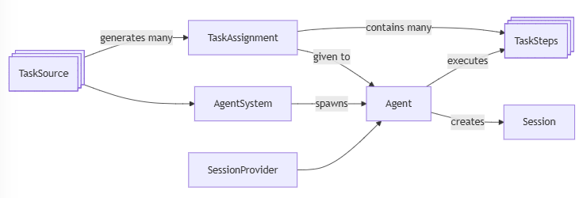
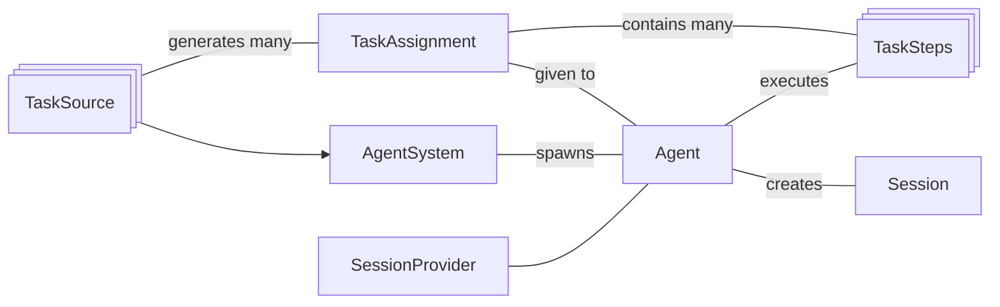

# Arclib Architecture

* `TaskStep` is a piece of code which executes one step of doing a task.  These steps are executed by an `Agent`.  This is where our business logic goes, into subclasses of `TaskStep`.
* `TaskAssignment` is a work assignment, including application-specific data (a dict) and the `TaskSteps` to accomplish it.
* `TaskSource` generates things we need to do, creates `TaskAssignments`.  There can be many TaskSources.
* `Agent` generates a `Session`, executes one or more `TaskSteps`, saving to the `SessionProvider` as we go.
* `AgentSystem` has a list of `TaskSources` and creates Agents to do each `TaskAssignment`.

## Diagram source

### Main components
These are the main components involved.
